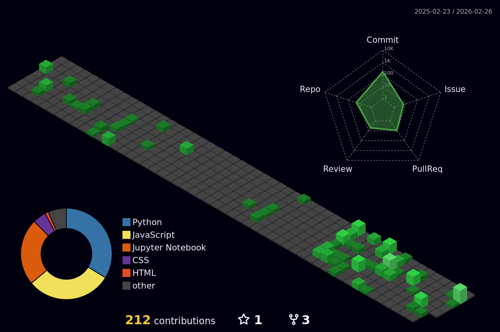

  

  <h3>Just another dev turning coffee into code ☕</h3>

 

  
  
  

 

## ⚡ About Me

- 🔭 I’m currently working on **My own job hunt lol**
- 🌱 I’m currently learning **Deep Learning**
- 👯 I’m looking to collaborate on **Open Source Projects**
- 💬 Ask me about **Python, Docker, Machine Learning, Deep Learning, and Cloud Computing, etc.**
- ⚡ Fun fact: **I can center a div without Googling it! (Sometimes)**

 

## 🛠️ Languages and Tools

### 👨‍💻 Languages

  
  
  
  
  
  
  
  
  
  
  
  
  
  

### ⚛️ Frameworks & Libraries

  
  
  
  
  
  

### ☁️ Cloud, Databases & DevOps

  
  
  
  
  
  
  
  
  
  
  
  

### 🎨 Design & Other Tools

  
  
  
  
  
  
  
  

 

## 📈 GitHub Stats

  

 

  
  

  

 

  

